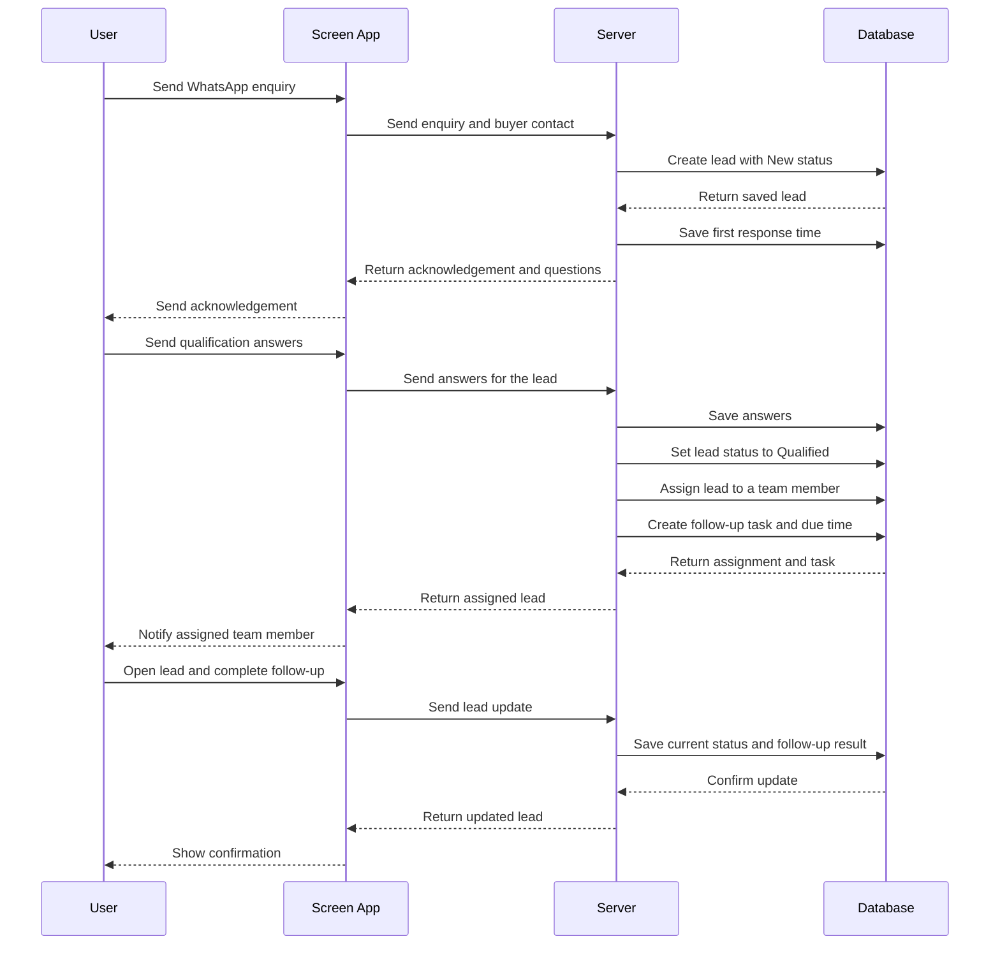
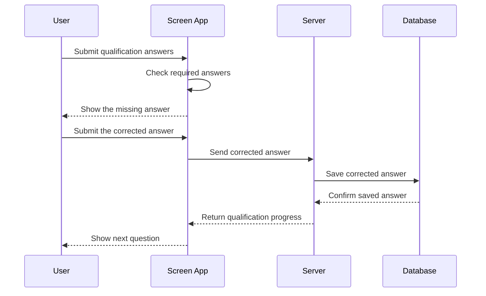

# Kora Pilot Sequence Diagrams

## Main flow

```mermaid
sequenceDiagram
    participant U as User
    participant A as Screen App
    participant S as Server
    participant D as Database

    U->>A: Send WhatsApp enquiry
    A->>S: Send enquiry and buyer contact
    S->>D: Create lead with New status
    D-->>S: Return saved lead
    S->>D: Save first response time
    S-->>A: Return acknowledgement and questions
    A-->>U: Send acknowledgement

    U->>A: Send qualification answers
    A->>S: Send answers for the lead
    S->>D: Save answers
    S->>D: Set lead status to Qualified
    S->>D: Assign lead to a team member
    S->>D: Create follow-up task and due time
    D-->>S: Return assignment and task
    S-->>A: Return assigned lead
    A-->>U: Notify assigned team member

    U->>A: Open lead and complete follow-up
    A->>S: Send lead update
    S->>D: Save current status and follow-up result
    D-->>S: Confirm update
    S-->>A: Return updated lead
    A-->>U: Show confirmation
```

## Exception path: missing qualification answer

```mermaid
sequenceDiagram
    participant U as User
    participant A as Screen App
    participant S as Server
    participant D as Database

    U->>A: Submit qualification answers
    A->>A: Check required answers
    A-->>U: Show the missing answer
    U->>A: Submit the corrected answer
    A->>S: Send corrected answer
    S->>D: Save corrected answer
    D-->>S: Confirm saved answer
    S-->>A: Return qualification progress
    A-->>U: Show next question
```
